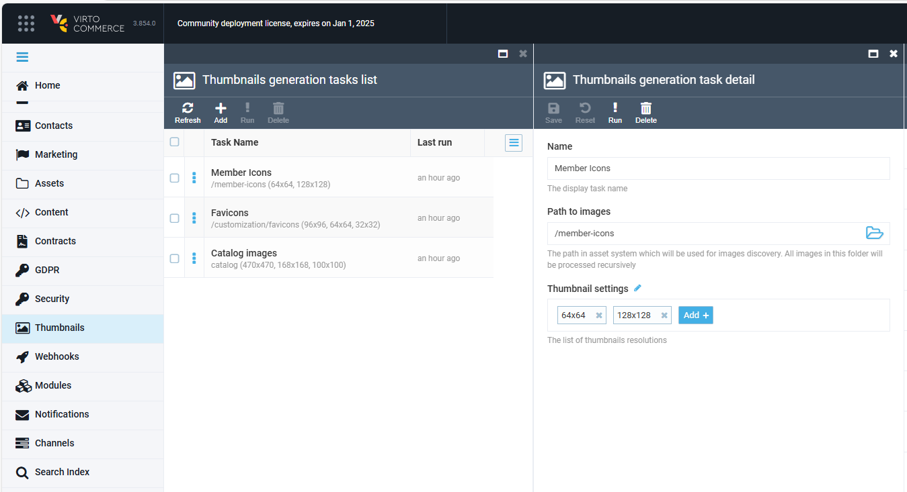

# Virto Commerce Image Tools Module

[](https://github.com/VirtoCommerce/vc-module-image-tools/actions?query=workflow%3A"Module+CI") [](https://sonarcloud.io/dashboard?id=VirtoCommerce_vc-module-image-tools) [](https://sonarcloud.io/dashboard?id=VirtoCommerce_vc-module-image-tools) [](https://sonarcloud.io/dashboard?id=VirtoCommerce_vc-module-image-tools) [](https://sonarcloud.io/dashboard?id=VirtoCommerce_vc-module-image-tools)

## Overview

The Image Tools Module provides comprehensive image processing capabilities for the Virto Commerce platform. It enables automatic thumbnail generation for product images, category banners, and other visual assets stored in blob storage.

The module features a **format-agnostic architecture** that supports both raster formats (JPEG, PNG, WebP) via [SixLabors.ImageSharp](https://docs.sixlabors.com/articles/imagesharp/index.html) and vector formats (SVG) with native XML manipulation, ensuring scalability without quality loss.



## Key Features

- **Multi-Format Support**: Process raster images (JPEG, PNG, WebP, GIF, BMP, TIFF) and vector graphics (SVG)
- **Flexible Resize Methods**:
  - `FixedSize` - Proportional fit within specified dimensions with optional padding
  - `FixedWidth` - Maintain aspect ratio, resize to target width
  - `FixedHeight` - Maintain aspect ratio, resize to target height
  - `Crop` - Crop to exact dimensions using configurable anchor positions
- **Background Processing**: Batch thumbnail generation via Hangfire jobs with progress tracking
- **Event-Driven Generation**: Automatic thumbnail creation on blob upload events
- **Incremental Processing**: Only process new or modified images since last run
- **Extensible Architecture**: Plugin-based format handlers for easy addition of new formats

## Configuration

### Application Settings

Configure the module in `appsettings.json`:

```json
{
  "ImageTools": {
    "Thumbnails": {
      "EnableImageProcessJob": false,
      "EventBasedThumbnailGeneration": true,
      "ImageProcessJobCronExpression": "0 0 * * *",
      "ProcessBatchSize": 50
    }
  }
}
```

| Setting | Type | Default | Description |
|---------|------|---------|-------------|
| `EnableImageProcessJob` | Boolean | `false` | Enable scheduled background job for thumbnail processing |
| `EventBasedThumbnailGeneration` | Boolean | `true` | Generate thumbnails automatically when images are uploaded |
| `ImageProcessJobCronExpression` | String | `0 0 * * *` | Cron expression for scheduled job (daily at midnight) |
| `ProcessBatchSize` | Integer | `50` | Number of images to process before reporting progress |

### Allowed Image Formats

Formats can be enabled/disabled via Platform Settings UI:
- **Raster**: JPEG, PNG, WebP (default), GIF, BMP, TIFF, TGA, PBM
- **Vector**: SVG

## Architecture

The module implements a **Handler-Based Architecture** for format-agnostic image processing:

```
┌─────────────────────────────────────────────────────────────────┐
│                  ThumbnailGenerationProcessor                    │
│                    (Orchestrates batch jobs)                     │
└─────────────────────────────┬───────────────────────────────────┘
                              │
┌─────────────────────────────▼───────────────────────────────────┐
│                   IThumbnailHandlerFactory                       │
│              (Routes to format-specific handler)                 │
└─────────────────────────────┬───────────────────────────────────┘
                              │
          ┌───────────────────┼───────────────────┐
          │                   │                   │
┌─────────▼─────────┐ ┌───────▼───────┐ ┌────────▼────────┐
│ RasterThumbnail   │ │ SvgThumbnail  │ │ Custom Format   │
│ Handler           │ │ Handler       │ │ Handler         │
│ (JPEG, PNG, WebP) │ │ (SVG, SVGZ)   │ │ (Extensible)    │
└─────────┬─────────┘ └───────┬───────┘ └─────────────────┘
          │                   │
┌─────────▼─────────┐ ┌───────▼───────┐
│ IThumbnailGen     │ │ ISvgService   │
│ (ImageSharp)      │ │ ISvgResizer   │
└───────────────────┘ └───────────────┘
```

### Extension Points

To add support for a new format:

1. Implement `IFormatThumbnailHandler`:
```csharp
public class PdfThumbnailHandler : IFormatThumbnailHandler
{
    public ImageFormatType SupportedFormatType => ImageFormatType.Raster;
    public int Priority => 10;

    public Task<bool> CanHandleAsync(string imageUrl)
        => Task.FromResult(imageUrl.EndsWith(".pdf"));

    public Task<ThumbnailGenerationResult> GenerateThumbnailsAsync(...) { ... }
}
```

2. Register in DI:
```csharp
serviceCollection.AddTransient<IFormatThumbnailHandler, PdfThumbnailHandler>();
```

## Components

### Core Interfaces

| Interface | Description |
|-----------|-------------|
| `IImageService` | Load/save raster images from blob storage |
| `IImageResizer` | Raster image resize operations |
| `ISvgService` | Load/save SVG content from blob storage |
| `ISvgResizer` | SVG dimension manipulation |
| `IImageFormatDetector` | Detect raster vs vector format type |
| `IFormatThumbnailHandler` | Format-specific thumbnail generation |
| `IThumbnailHandlerFactory` | Route to appropriate format handler |
| `IThumbnailGenerator` | Core thumbnail generation orchestration |
| `IThumbnailGenerationProcessor` | Batch processing with progress tracking |
| `IImagesChangesProvider` | Detect new/modified images in blob storage |

### Services

| Service | Description |
|---------|-------------|
| `DefaultImageService` | ImageSharp-based raster image I/O |
| `DefaultImageResizer` | ImageSharp resize with multiple methods |
| `DefaultSvgService` | SVG blob storage operations |
| `DefaultSvgResizer` | SVG XML manipulation for resizing |
| `DefaultImageFormatDetector` | Extension-based format detection |
| `DefaultThumbnailHandlerFactory` | Priority-based handler selection |
| `RasterThumbnailHandler` | Raster format processing |
| `SvgThumbnailHandler` | Vector format processing |

### Background Jobs

| Job | Description |
|-----|-------------|
| `ThumbnailProcessJob` | Hangfire job for scheduled/manual thumbnail generation |

### Domain Models

| Model | Description |
|-------|-------------|
| `ThumbnailTask` | Configuration for a thumbnail generation task (work path, options) |
| `ThumbnailOption` | Single thumbnail variant (size, method, quality, suffix) |
| `SvgDimensions` | SVG width, height, and viewBox attributes |

## Documentation

* [Image Tools module user documentation](https://docs.virtocommerce.org/platform/user-guide/thumbnails/overview/)
* [REST API](https://virtostart-demo-admin.govirto.com/docs/index.html?urls.primaryName=VirtoCommerce.ImageTools)
* [View on GitHub](https://github.com/VirtoCommerce/vc-module-image-tools)


## References

* [Deployment](https://docs.virtocommerce.org/platform/developer-guide/Tutorials-and-How-tos/Tutorials/deploy-module-from-source-code/)
* [Installation](https://docs.virtocommerce.org/platform/user-guide/modules-installation/)
* [Home](https://virtocommerce.com)
* [Community](https://www.virtocommerce.org)
* [Download latest release](https://github.com/VirtoCommerce/vc-module-image-tools/releases/latest)

## License

Copyright (c) Virto Solutions LTD. All rights reserved.

Licensed under the Virto Commerce Open Software License (the "License"); you
may not use this file except in compliance with the License. You may
obtain a copy of the License at

http://virtocommerce.com/opensourcelicense

Unless required by applicable law or agreed to in writing, software
distributed under the License is distributed on an "AS IS" BASIS,
WITHOUT WARRANTIES OR CONDITIONS OF ANY KIND, either express or
implied.
